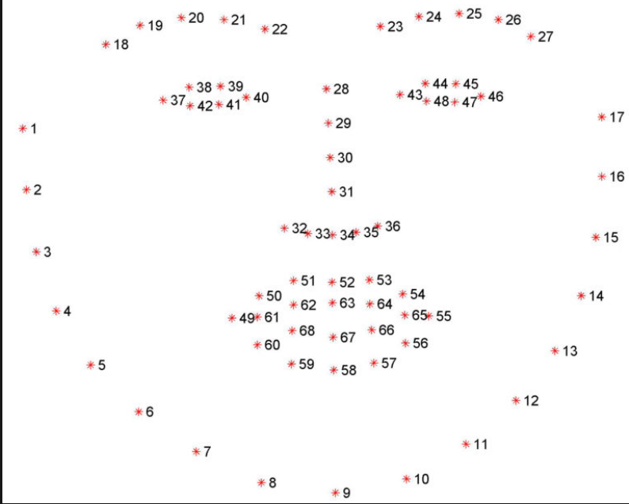
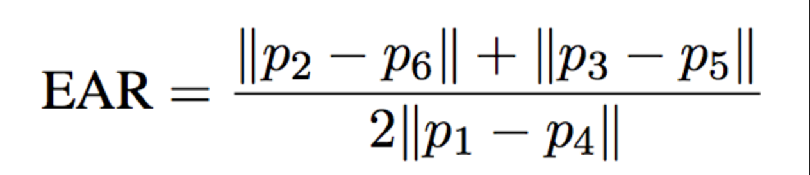

# Driver Drowsiness Detection System

A computer-vision based project for detecting driver drowsiness from eye-related facial features in real time and generating an alert when prolonged eye closure is detected.

## Overview

The system uses a webcam feed to detect a driver's face and facial landmarks, extracts the eye regions, calculates the Eye Aspect Ratio (EAR), and checks whether the eyes remain closed for a configured number of consecutive frames.

When the EAR stays below the configured threshold for the required consecutive frames, the system triggers a drowsiness alert.

## How It Works

```text
Webcam
   ↓
Face Detection
   ↓
Facial Landmark Detection
   ↓
Eye Landmark Extraction
   ↓
Eye Aspect Ratio (EAR)
   ↓
Consecutive Frame Check
   ↓
Drowsiness Alert
```

## Technologies Used

- Python
- OpenCV
- dlib
- NumPy
- SciPy
- imutils
- playsound

## Detection Approach

The project uses facial landmarks to identify the driver's eyes and calculates the **Eye Aspect Ratio (EAR)** as the main indicator of eye closure.

The implementation monitors the EAR over consecutive video frames. A drowsiness alert is raised when the configured EAR condition persists for the specified number of frames.

## Project Files

| File | Purpose |
|---|---|
| `drowsiness_detection.py` | Real-time drowsiness detection with visual alert logic |
| `alarm_detection.py` | Drowsiness detection implementation with an audio alarm |
| `alarm.wav` | Alert sound used by the alarm implementation |
| `requirements.txt` | Python dependencies |
| `Images/` | Supporting diagrams and EAR/facial-landmark visuals |

## Visuals

### Facial Landmark Detection



### Eye Region


### Eye Aspect Ratio



## Key Learning Outcomes

- Real-time video processing with OpenCV
- Facial landmark detection
- Eye feature extraction
- Eye Aspect Ratio based detection
- Threshold-based event detection
- Audio alert integration

## Limitations

This implementation can be affected by factors such as lighting conditions, face orientation, glasses or other visual obstructions, and differences in facial or eye characteristics.

## Note

The original project used the dlib 68-point facial landmark predictor model. The large pretrained model file is intentionally **not included in this GitHub repository**. Download and place the required model file locally before running the project.

## Running the Project

1. Install the dependencies from `requirements.txt`.
2. Place the required dlib facial landmark predictor file in the project directory.
3. Connect a webcam.
4. Run one of the detection scripts.

Example:

```bash
python drowsiness_detection.py
```

or

```bash
python alarm_detection.py
```
