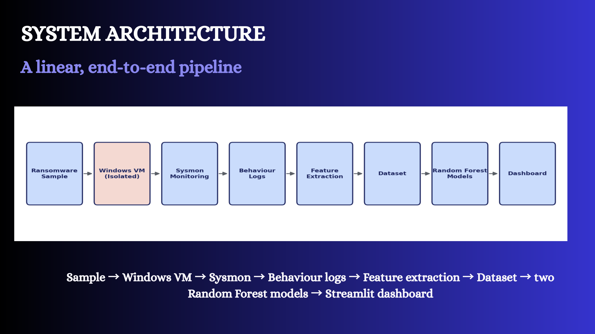
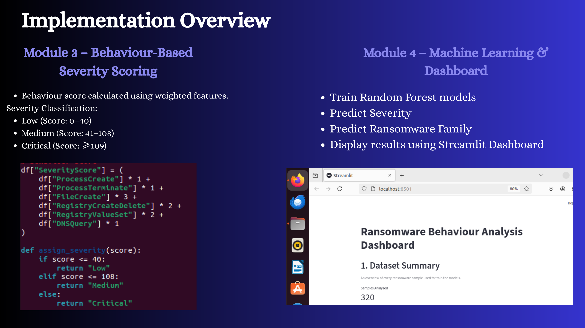
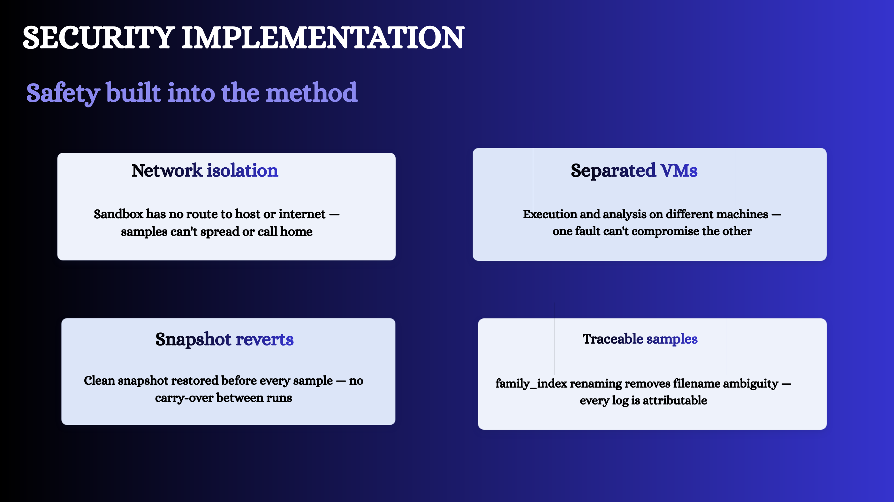
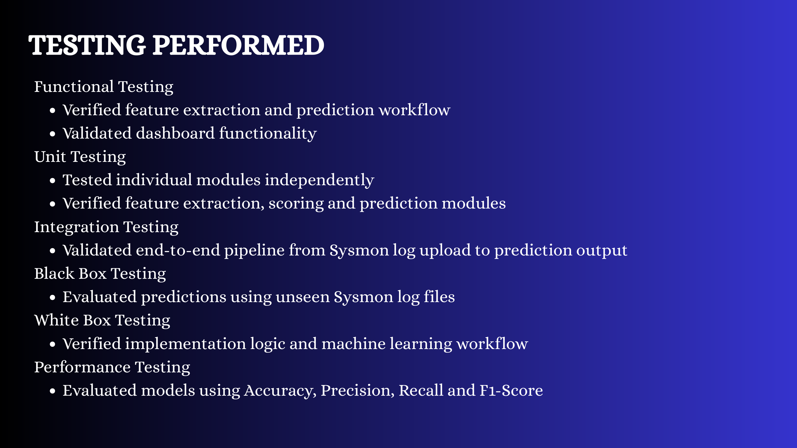

# Ransomware Detection, Family Classification and Severity Prediction Using Machine Learning

## Project Overview

A behaviour-based ransomware analysis framework developed as an MSc Cyber Security individual project. The system uses Sysmon telemetry collected from ransomware executions inside an isolated Windows virtual machine, converts the logs into behavioural features, and uses Random Forest models to predict attack severity and identify the ransomware family.

The project also includes an interactive Streamlit dashboard for reviewing the dataset, model outputs, and feature importance.

> **Safety note:** Ransomware execution was performed manually inside an isolated virtual environment with no route to the host or internet. This repository contains documentation and selected project visuals only; it does not contain live malware samples.

## Problem Statement

Traditional signature-based detection can struggle with new or modified ransomware variants. This project explores a behaviour-based approach that analyses what the sample does during execution rather than relying only on a known file signature.

## Objectives

- Capture ransomware behaviour using Sysmon.
- Extract structured behavioural features from event logs.
- Calculate a weighted behavioural severity score.
- Predict ransomware severity using a Random Forest classifier.
- Classify the ransomware family using a second Random Forest classifier.
- Present results through an analyst-facing Streamlit dashboard.

## System Architecture

**Pipeline:**

`Ransomware Sample → Isolated Windows VM → Sysmon → Behaviour Logs → Feature Extraction → Dataset → Random Forest Models → Streamlit Dashboard`

## Behavioural Features

The project focuses on four broad behavioural categories:

- Process activity
- File-system activity
- Registry activity
- Network activity

The implementation extracted features including process creation, process termination, file creation, registry creation/deletion, registry value modification, and DNS queries.

## Severity Scoring

A weighted behavioural score was used to support triage. The implemented classification thresholds were:

| Severity | Score |
|---|---:|
| Low | 0–40 |
| Medium | 41–108 |
| Critical | ≥109 |

The project also used the Random Forest severity model to predict severity from the behavioural profile.

## Dashboard

The Streamlit dashboard presents the dataset and model results and provides an interface for reviewing predictions.

## Security and Containment

The analysis environment used:

- Isolated virtual machines
- Network isolation
- Clean snapshot restoration before each sample
- Separate execution and analysis environments
- Traceable sample naming / indexing

## Data Collection and Dataset

Live ransomware samples were executed manually, one at a time, in the isolated Windows 10 VM. Sysmon logs were exported after each run and parsed into structured behavioural features.

The project captured a limited number of real behavioural profiles and then expanded the dataset synthetically for model training. The expanded dataset contained 320 rows spanning 26 ransomware families; these rows should not be interpreted as 320 unique live ransomware executions.

## Machine Learning

Two Random Forest classifiers were developed:

### Severity Prediction Model

Predicts the severity category of a ransomware behavioural profile.

**Accuracy:** 96.88%  
**Precision:** 96.92%  
**Recall:** 96.88%  
**F1 Score:** 96.86%

### Ransomware Family Classification Model

Predicts the ransomware family associated with a behavioural profile.

**Accuracy:** 93.75%  
**Precision:** 95.83%  
**Recall:** 93.75%  
**F1 Score:** 93.38%

These results are project-level evaluation results on the dataset used for the study and should not be treated as evidence of production or enterprise-scale accuracy.

## MITRE ATT&CK Mapping

Observed behavioural indicators were reviewed against MITRE ATT&CK concepts. Examples discussed in the project include:

- File renaming / modification → Data Encrypted for Impact
- Recovery-related interference → Inhibit System Recovery
- Process execution patterns → Execution-related behaviour
- Registry activity → Persistence / recovery-related behaviour where applicable

## Testing

Testing covered:

- Functional testing
- Unit testing
- Integration testing
- Black-box testing
- White-box testing
- Performance evaluation using accuracy, precision, recall, and F1 score

## Technology Stack

`Python 3.10` · `VMware Workstation` · `Windows 10` · `Ubuntu 22.04` · `Microsoft Sysmon` · `Pandas` · `Scikit-learn` · `Random Forest` · `Joblib` · `Streamlit`

## Limitations

- The number of safely collected live samples was limited.
- Analysis focused on runtime behaviour rather than static analysis or reverse engineering.
- The dataset included synthetic expansion because the number of real captures was small.
- The framework has not been validated at enterprise production scale.

## Future Improvements

- Increase the number of real ransomware samples.
- Add additional behavioural signals such as API and memory events.
- Improve severity scoring using real incident data.
- Integrate with SIEM / EDR platforms for broader monitoring.
- Evaluate additional machine-learning approaches.
- Extend the framework to additional malware categories.

## Academic Context

**MSc Cyber Security — Individual Project**  
PSB Academy / Coventry University programme  
July 2026

## Author

**Varshini Senthilnathan**
