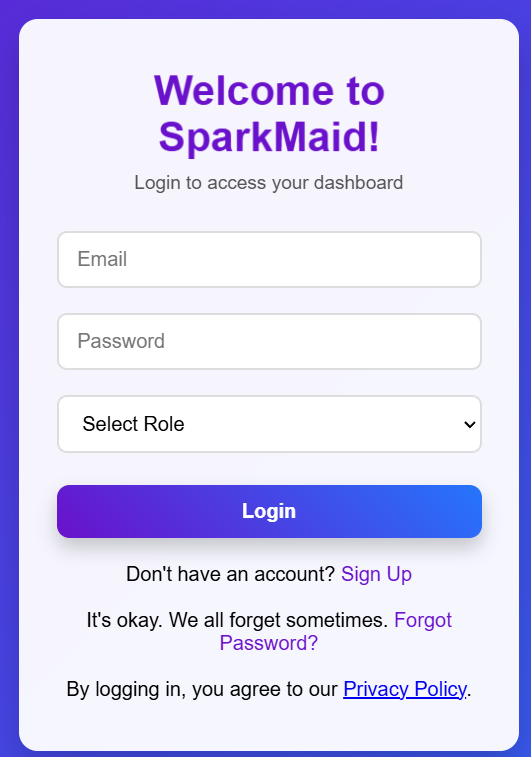
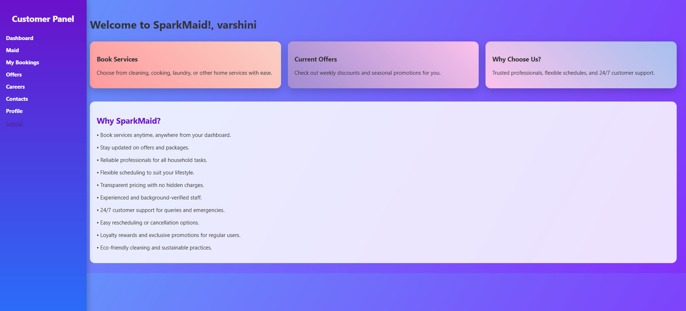
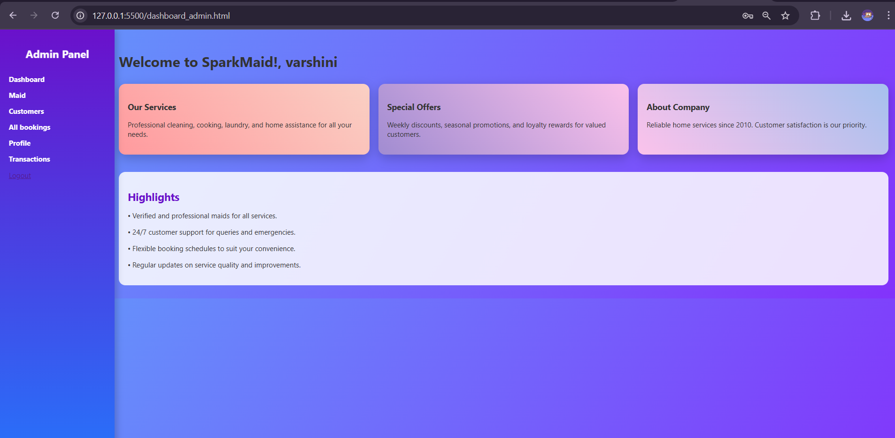
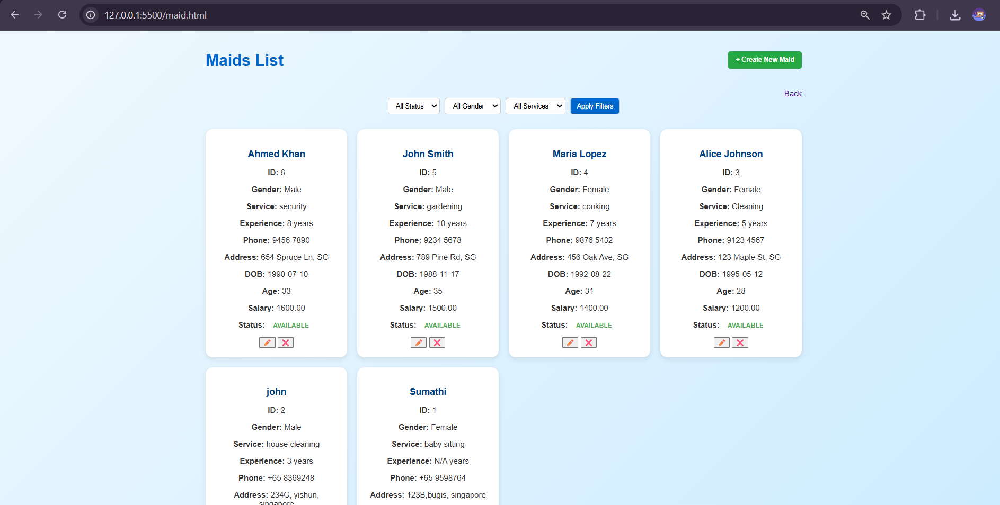
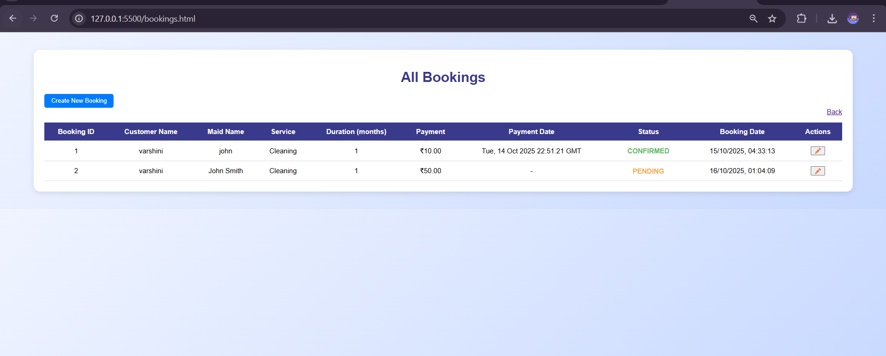

# SparkMaid — Maid Booking Web Application

A full-stack web application developed as an academic project to digitise the maid booking process. SparkMaid provides separate customer and admin workflows for registration, login, maid discovery, booking, and account management.

## Project Overview

SparkMaid was designed to make finding and booking domestic help more organised and convenient. Customers can register, verify their account using OTP, browse available maids, filter listings, create bookings, view booking status, manage their profile, and use password-reset functionality. Administrators can manage maid listings, review customer activity, and approve or reject bookings.

The project was developed using an iterative SDLC approach, with repeated cycles of planning, design, development, testing, and local deployment.

## Key Features

### Customer
- Registration with OTP verification
- Login and logout
- Browse and filter maid listings
- Create and manage bookings
- View booking status
- Profile management
- Forgot/reset password flow
- Privacy and support pages

### Admin
- Separate admin login
- Add and manage maid listings
- View customer login/activity information
- Approve or reject bookings
- Manage customer and booking information
- Admin profile and transaction views

## Security-Focused Features

- OTP-based registration verification
- Role-based access between customer and admin workflows
- Password hashing in the application layer
- Input validation
- Session/access-control checks
- Separate administrative permissions

The project report also documents security testing using incorrect passwords, OTP verification and data validation scenarios.

## Technology Stack

**Frontend**
- HTML
- CSS
- JavaScript

**Backend**
- Python
- Flask

**Database**
- MySQL
- MySQL Workbench

**Development / Testing Tools**
- Visual Studio Code
- Postman
- draw.io
- ClickUp

## Architecture

```text
Customer / Admin Browser
          |
          v
 HTML + CSS + JavaScript
          |
          v
      Flask Backend
          |
          +------ Authentication / OTP
          +------ Booking Management
          +------ Maid Management
          +------ Customer Management
          |
          v
       MySQL Database
```

## Code Structure

```text
SparkMaid/
├── Backend/
│   ├── run.py
│   ├── config.example.py
│   └── myapp/
│       ├── routes/
│       ├── service/
│       └── utils/
│
└── Frontend/
    ├── *.html
    ├── css/
    └── js/
```

## Testing

The project included multiple levels of testing:

- Unit testing of individual functions such as OTP validation, login validation, bookings and approvals
- Integration testing between the frontend, Flask backend and database
- Functional testing of registration, login, maid listing, booking and approval workflows
- Security testing using invalid credentials, OTP verification and input validation
- Manual and end-to-end testing throughout iterative development

## Screenshots

### Login


### Customer Dashboard


### Admin Dashboard


### Maid Listings


### Booking Management


## Security / Design Notes

The project documentation describes secure-design considerations such as role separation, validation, OTP verification, password hashing, and protection of customer data. The application was developed and tested in a local environment.

For this public portfolio repository, local credentials are intentionally excluded. Use `config.example.py` as a template for a local `config.py` file.

## Learning Outcomes

This project strengthened my practical experience in:

- Full-stack web application development
- Flask routing and service-layer organisation
- SQL database integration and CRUD operations
- Authentication and OTP workflows
- Role-based access control concepts
- Input validation and security testing
- Iterative software development and testing

## Project Context

Developed as part of the MSc Cyber Security coursework module **Secure Design and Development**.
